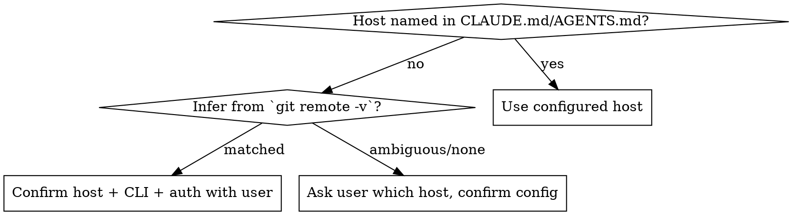

# Addressing Review Comments

## Overview

Turn reviewer feedback on a pull/merge request into verified, committed fixes — for
**any git host**. Runs the full loop: **identify host → fetch every comment → categorize →
fix (or decline with a reason) → verify → commit & push → optionally reply/resolve**.

**Core principle:** Every review comment gets an explicit disposition. Required items are
fixed; suggestions are applied *or declined with a technical reason* — never silently
skipped, never blindly obeyed.

**This skill responds to a review; it does not perform one.** To *produce* a review, use
`code-review` / `code-reviewer` instead.

## When to Use

- "Address / apply / fix / resolve the review comments on PR #123 (or this MR)"
- "The reviewer left feedback — go implement it"
- After a teammate reviews your branch and you need to act on the notes

**Not for:** writing a review of someone else's code, or resolving merge conflicts.

## Workflow

Create a todo per step and work them in order.

### 1. Preflight — identify the host and confirm tooling

Determine the git host, its CLI, and that you're authenticated **before** fetching anything.

- If the project docs (CLAUDE.md / AGENTS.md) name the host, use it.
- Otherwise infer from `git remote -v` (github.com → GitHub, gitlab.com or self-managed
  GitLab → GitLab, etc.). Confirm the CLI is installed and authenticated
  (`gh auth status` / `glab auth status`).
- **If the host can't be determined, or the CLI/auth isn't confirmed: ASK the user which
  platform they use and confirm the configuration** (CLI tool, host URL, repo) before
  proceeding. Do not guess.

Read **references/platforms.md** for the exact fetch/reply commands per host.

### 2. Fetch every comment

Pull all feedback, not just inline diff comments. Extract only the fields you need
(`--jq` / `-F json`) so a large PR doesn't flood context:

- **Inline review comments** — path, line, body, and diff hunk.
- **General PR/MR comments** and **review summaries** (approve / request-changes / comment).

Note the PR's **head branch** and **base branch** — you need the head branch in step 8.

### 3. Categorize every comment

Build a table so nothing is dropped. Classify each by the reviewer's intent, not just tone:

| Class | Signal | Action |
|-------|--------|--------|
| **Required** | "Required", "must", "blocker", request-changes | Fix in this pass |
| **Suggestion** | "Suggest", "nit", "consider", "maybe" | Apply if it improves the code, else decline with a reason |
| **Future / out-of-scope** | "in the future", "follow-up", "later" | Acknowledge, no change now; note as follow-up |

### 4. Verify current code state

**The code may have evolved since the review was written.** Re-read the actual files —
never trust the diff hunk alone. A comment may already be resolved, or the surrounding code
may have moved. Anchor your fix to what the file says *now*.

### 5. Follow project conventions

Before inventing a fix, find how the codebase already solves the same problem (config
externalization, naming, error handling, test setup) and match it. Grep for an existing
precedent; read the project's `.claude/rules/*` or style docs if present.

### 6. Honor the project's pre-edit / pre-commit checks

Some projects mandate steps around edits (impact analysis, change detection, formatters,
lint). Read CLAUDE.md / AGENTS.md and run whatever it requires **before** editing and
**before** committing. Warn the user on HIGH/CRITICAL risk.

### 7. Propose fixes — apply Required, judge Suggestions

- **Required:** implement the concrete fix, surgically — touch only what the comment needs.
- **Suggestions:** apply when they genuinely improve the code; **decline with a specific
  technical reason** when they don't. Do not perform agreement, and do not obey blindly.
  **REQUIRED BACKGROUND:** apply `superpowers:receiving-code-review` — verify each
  suggestion technically and push back when warranted.
- Surface tradeoffs and get approval before a large or contentious change.

### 8. Verify before claiming done

- Build passes and the **affected tests** pass (`superpowers:verification-before-completion`).
- A config/DI change can break unit tests that bypass the framework (e.g. a new `@Value`
  field is null in a plain Mockito test) — fix the test wiring your change caused.
- Re-run the project's change-detection / diff review to confirm scope is only what you
  intended.

### 9. Commit & push to the PR's head branch

- Conventional Commit referencing the PR/MR (e.g. `Refs: #123`). Follow the project's
  commit conventions and signing.
- **Confirm the branch you're on IS the PR's head branch (from step 2) before pushing.**
  Committing to a different branch does *not* put the fixes on the PR — verify the mapping
  and tell the user explicitly if they differ.
- Run signing/network commands (commit, push) directly rather than a fail-then-retry cycle.

### 10. Optionally reply and resolve

Offer to reply to each thread explaining the resolution, and to resolve/close threads that
are fully addressed. See **references/platforms.md** for reply/resolve commands per host.
Confirm before posting anything public.

## Red Flags — stop and reconsider

- About to fetch comments without confirming the host/CLI/auth → do step 1 first; ask if unsure.
- About to fix from the diff hunk without opening the file → the code may have moved (step 4).
- About to silently drop a "Suggest" comment → give it an explicit disposition (step 3, 7).
- About to agree with a suggestion you think is wrong → verify and push back (`receiving-code-review`).
- About to claim "fixes are on the PR" → confirm branch == PR head branch first (step 9).
- About to `git commit`/`push` and hesitating on sandbox → run these directly (step 9).

## Common Mistakes

- Fetching only inline comments and missing the review summary or general comments.
- Patching against a stale diff hunk instead of the current file.
- Externalizing a value with a new name instead of the project's existing config convention.
- Marking work complete without running the affected tests.
- Committing to the wrong branch and reporting the PR is updated when it isn't.
